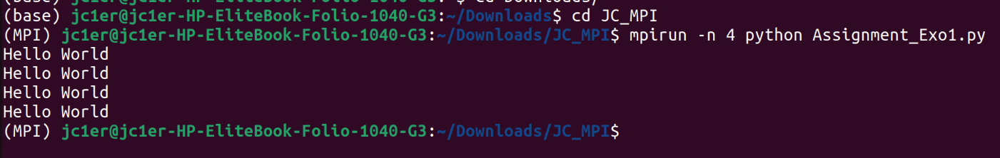
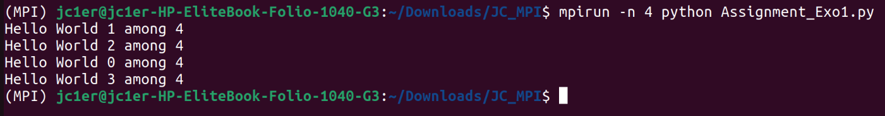
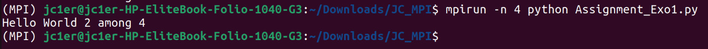
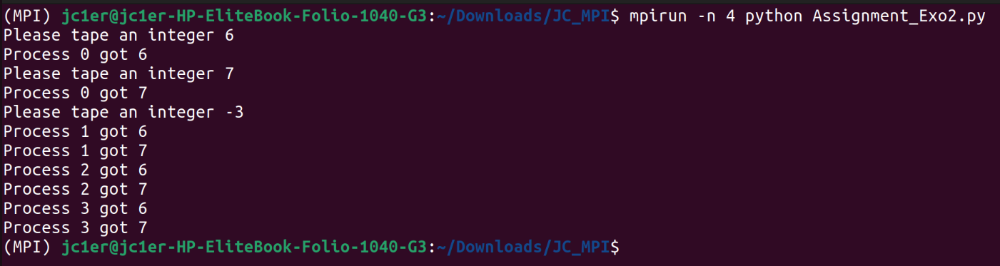
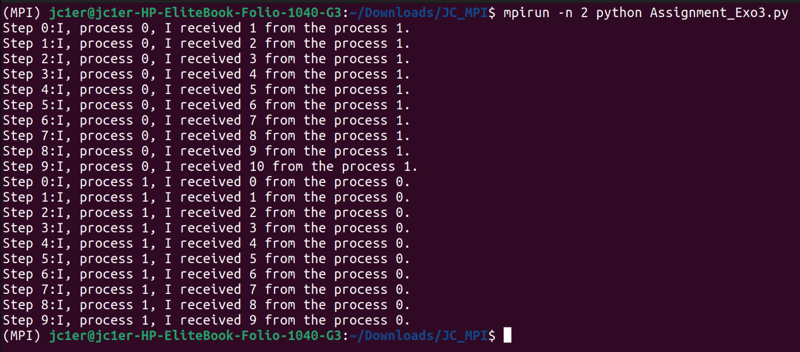
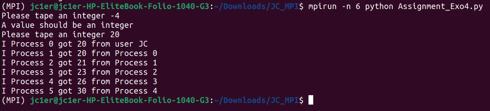
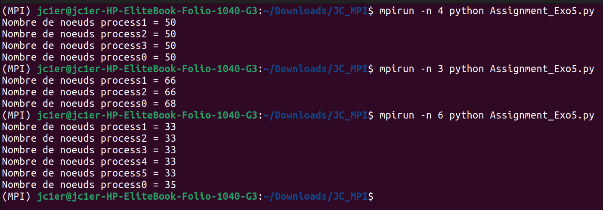
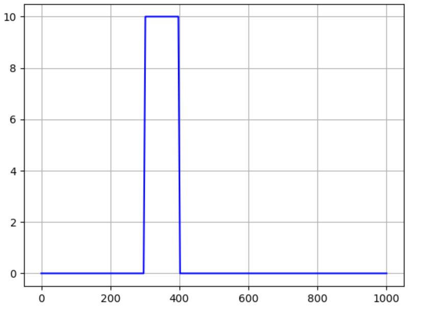
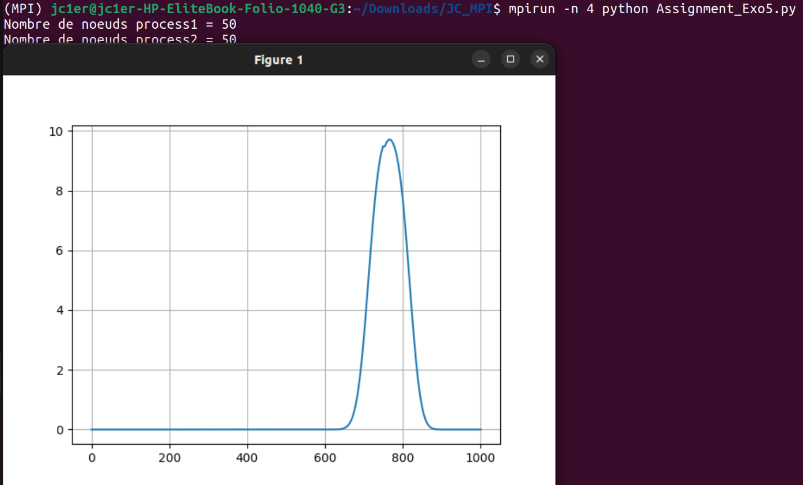
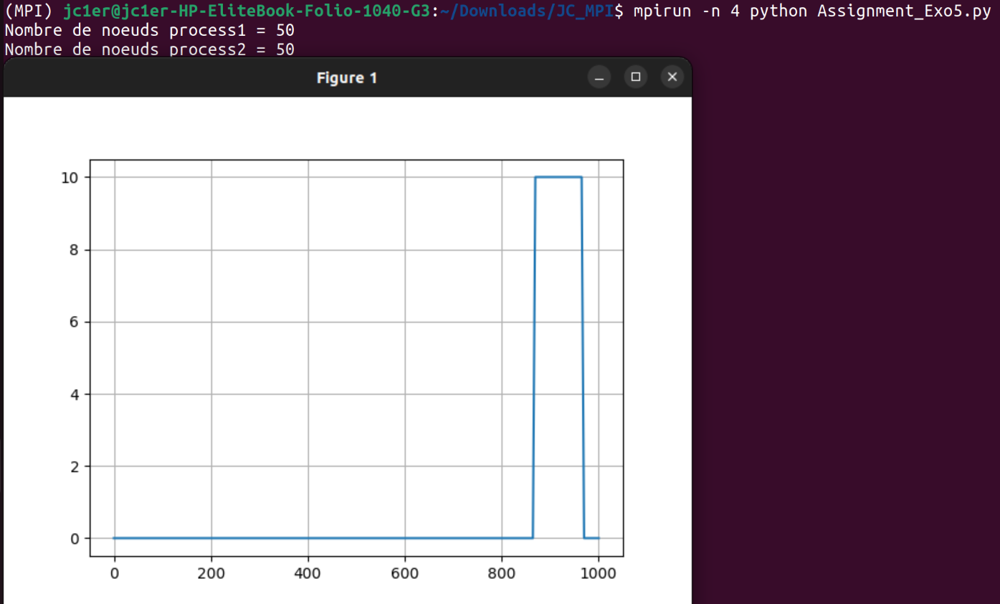

>  # **<p align = center>Tp1</p>** 
> - # **Author: MITCHOZOUNOU Jean-CLaude**
>   - ## **Institute: UM6P**

<br />

---
# *Assignment 1 - Point to Point communications*
---

> ## *Exercise 1*: Hello world ##

- **Let write an MPI program which prints the message "Hello World"**

```python

from mpi4py import MPI
#Communicator , Rank and s i z e
COMM = MPI.COMM_WORLD
SIZE = COMM.Get_size()
RANK = COMM.Get_rank()
print("Hello World")
```
>Output


- **<p align = center> Let modify our program so that each process prints out both its rank and the total number of processes P that the code is running on.</p>**


```python

from mpi4py import MPI

COMM = MPI.COMM_WORLD
SIZE = COMM.Get_size()
RANK = COMM.Get_rank()
print(f"Hello World {RANK} among {SIZE}")

```
>Output


- **Let modify our program so that only a single controller process (e.g. rank 0) prints out a message**

```python

from mpi4py import MPI

COMM = MPI.COMM_WORLD
SIZE = COMM.Get_size()
RANK = COMM.Get_rank()
if RANK == 2: ## In our case we are choosen the 
    print(f"Hello World {RANK} among {SIZE}")

```
> Output


---
---

> ## *Exercise 2* : Sharing Data ##

- **<p align = center>Let create a program that obtains an integer input from the terminal and distributes it to all the MPI processes. Each process must display its rank and the received value. Keep reading values until a negative integer is entered</p>**

```python
from mpi4py import MPI

COMM = MPI.COMM_WORLD
SIZE = COMM.Get_size()
RANK = COMM.Get_rank()
Tag = 1


Tag = 1


while True:
    if RANK == 0:
            value = int(input("Please tape an integer "))
            if value < 0:
                for r in range(1,SIZE):
                    COMM.send(value, dest = r, tag = Tag)
                break
            print(f"Process {0} got {value}")
            for r in range(1,SIZE):
                COMM.send(value, dest = r, tag = Tag)
    else:
        data = COMM.recv(source = 0, tag = Tag )
        if data <0:
             break
        print(f"Process {RANK} got {data}")

```
> Output


---
---
> ## *Exercise 3* : Sharing Data ##

- **<p align = center>Let mplement a ping-pong program using MPI. Process 0 sends an initial message (an integer) to process 1, which then increments the value and sends it back to process 0. This exchange happens for a fixed number of iterations</p>**

```python

from mpi4py import MPI

COMM = MPI.COMM_WORLD
SIZE = COMM.Get_size()
RANK = COMM.Get_rank()
value = 0

N = 10 # Number of iterations

for i in range(N):
    if RANK == 0:
        COMM.send(value, dest=1)
        value = COMM.recv(source=1)
        print(f"Step {i}:I, process {RANK}, I received {value} from the process 1.")
    print("\n")  
    if RANK == 1:
        value = COMM.recv(source=0)
        print(f"Step {i}:I, process {RANK}, I received {value} from the process 0.")
        value += 1
        COMM.send(value, dest=0)

```
>Output


---
---

> ## *Exercise 4* : Sending in a ring (Broadcast by ring) ##

- **<p align = center>Let write a program that takes data from process zero and sends it to all of the other processes by sending it in a ring. That is, process i should receive the data add the rank of the process to it then send it to process i+1, until the last process is reached. Assume that the data consists of a single integer. Process zero reads the data from the user,print the process rank and the value received.</p>**

```python
from mpi4py import MPI

COMM = MPI.COMM_WORLD
SIZE = COMM.Get_size()
RANK = COMM.Get_rank()
#Tag = 1


if RANK == 0:
    data = int(input("Please tape an integer "))
    while data < 0:
        print("A value should be an integer")
        data = int(input("Please tape an integer "))
    print(f"I Process {0} got {data} from user JC")
    COMM.send(data, dest = RANK+1, tag = 0)

for i in range(1,SIZE-1):
     if RANK == i:
        data = COMM.recv(source = RANK-1, tag = 0)
        print(f"I Process {RANK} got {data} from Process {RANK-1}" )
        COMM.send(data+i, dest = i+1, tag = 0)

if RANK == SIZE-1:
    data = COMM.recv(source = RANK-1, tag = 0)
    print(f"I Process {RANK} got {data} from Process {RANK-1}")
          

```


>Output


---
---

> ## *Exercise 5* :  Solving 1D advection equation ##

- **Let solve 1D advection equation using MPI**

```python

import numpy as np
import matplotlib.pyplot as plt
from mpi4py import MPI
from time import process_time_ns


COMM = MPI.COMM_WORLD
nproc = COMM.Get_size()
RANK = COMM.Get_rank()

# Longueur du canal
L = 1000
# Temps Final
nt = 100
# Nombre de noeuds du maillage
nx = 200
# Le pas du maillage
dx = L/(nx-1)

# Vitesse du transport
c = 1
# CFL 
CFL = 0.8
dt = CFL*dx/c


def f(x):
    if (300<=x<=400):
        return 10
    return 0

# Condition initiale
x = np.linspace(0,L,nx)
u0 = np.zeros(nx)
for i in range(nx):
    u0[i] = f(x[i])
# Tracé de la condition initiale
#plt.plot(x,u0,'-b')
#plt.grid()
#plt.show()


def solve_1d_linearconv(u, un, nt, nx, dt, dx, c):
    for n in range(nt):  
        for i in range(nx): un[i] = u[i]
        for i in range(1, nx): 
            u[i] = un[i] - c * dt / dx * (un[i] - un[i-1])
    return u

# Resolution parallèle

def solve_1d_linear_parallel(u, un, nt, nx, dt, dx, c):
    v = 0
    nloc = nx// nproc
    nlocP0 = nloc + (nx % nproc) # Au cas oú la division n'est pas exact , on étend le nombre
                # de noeuds du process 0 en y ajoutant le reste de la division
    
    u1 = np.zeros(nlocP0+1)
    u2 = np.zeros(nloc+1)
    U = np.empty(0) # Pour collecter les sous sections de la solution sur
        
    
    #COMM.Barrier()

    # Initialisation des données sur chaque process


    if RANK == 0:
        for i in range(nlocP0):
            u1[i] = u[i]
        u1[nlocP0] = u1[nlocP0-1]
        COMM.send(u1[nlocP0], dest=RANK+1)
        #v = u1[0:nlocP0]
        

    for j in range(1,nproc-1):  
        if RANK == j:
            u2[0] = COMM.recv(source = RANK-1)
            for i in range(nlocP0+(RANK-1)*nloc,nlocP0+RANK*nloc):
                u2[nlocP0+RANK*nloc-i] = u[i]
            u2[nloc] = u2[nloc-1]
            COMM.send(u2[nloc], dest=RANK+1)
            #v = u2[0:nloc]
            
    if RANK == nproc-1:
        u2[0] = COMM.recv(source = RANK-1)
        for i in range(nlocP0+(RANK-1)*nloc,nlocP0+RANK*nloc):
            u2[nlocP0+RANK*nloc-i] = u[i]
        #v = u2[0:nloc]
        


    # Calculs des valeurs u_n et échange des valeurs de bords

    for n in range(nt):
        if RANK == 0:
            for i in range(nlocP0): un[i] = u1[i]
            for i in range(1, nlocP0): 
                u1[i] = un[i] - c * dt / dx * (un[i] - un[i-1])

            u1[nlocP0] = u1[nlocP0-1]
            COMM.send(u1[nlocP0], dest=RANK+1)
            v = u1[0:nlocP0]
            z = len(v)
            
            
        
        for j in range(1,nproc-1):  
            if RANK == j:
                for i in range(nloc): un[i] = u2[i]
                for i in range(1, nloc): 
                    u2[i] = un[i] - c * dt / dx * (un[i] - un[i-1])
                u2[0] = COMM.recv(source = RANK-1)
                u2[nloc] = u2[nloc-1]
                COMM.send(u2[nloc], dest=RANK+1)
                v = u2[0:nloc]
                z = len(v)


        if RANK == nproc-1:
            for i in range(nloc): un[i] = u2[i]
            for i in range(1, nloc): 
                u2[i] = un[i] - c * dt / dx * (un[i] - un[i-1])
            u2[0] = COMM.recv(source = RANK-1)
            v = u2[0:nloc]
            z = len(v)
            
        #COMM.Barrier()


# Racollement des vecteurs : On recolle tout via le process 0
    if RANK == 0:
        U = np.concatenate((U,v))
        for p in range(1,nproc):
            U = np.concatenate((U,COMM.recv(source = p, tag = 1)))
        #plt.plot(x,U)
        #plt.grid()
        #plt.show()
        #print("La solution s'écrit: U = ",U)
    
    for k in range(1,nproc):
        if RANK == k:
            COMM.send(v,dest = 0, tag = 1)

    return z #U


# Découpage des tâches et attribution aux processes.
    
if nproc ==1: # Le cas oú il y un seul processeur
    nloc = nx
    un = np.zeros(nx)
    u = solve_1d_linearconv(u0,un,nt,nx,dt,dx,c)
    plt.plot(x,u0,'-r')
    plt.grid()
    plt.show()

else: # Au moins deux processeurs
    un = np.zeros(nx)
    u = np.array(solve_1d_linear_parallel(u0,un,nt,nx,dt,dx,c))


print(f"Nombre de noeuds process{RANK} = {u}")


```

 > *Gestion de la répartition du nombre de noeuds par processeur quelque soit le nombre process*
 

 > *Solution initiale*
 

 >Output : CFL = 0.7
 
 >Output : CFL = 1
 
 > Commentaire: On constate bien qu'il y une translation. Ce qui justifie bien la pertinence de la solution. 

>[Lien vers les bouts de code](https://colab.research.google.com/drive/1L2GVDVC4DLQVfKh8nPMaVg_9zP-EpJ42?usp=sharing) 