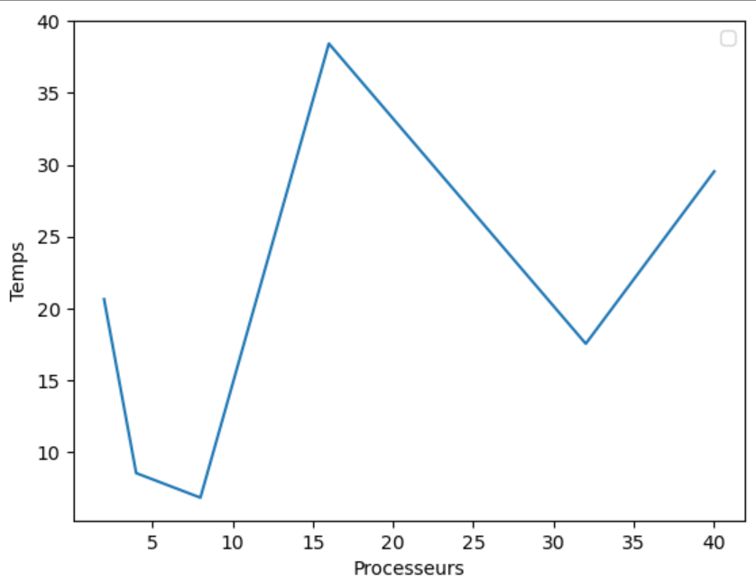

>  # **<p align = center>Tp2</p>** 
> - # **Author: MITCHOZOUNOU Jean-CLaude**
>   - ## **Institute: UM6P**

<br />

---
# *Assignment 1 - Collective communications*
---

> ## *Exercise 1*: Parallel Monte Carlo for PI ##


- **Let implement a parallel version of Monte Carlo using the function above**

```python
import numpy as np 
import time as tm
from mpi4py import MPI
COMM = MPI.COMM_WORLD
RANK = COMM.Get_rank()
Nproc = COMM.Get_size()


# Functions 

def compute_points(param): 
    circle_points= 0
    # Total Random numbers generated= possible x 
    # values* possible y values 
    for i in range(param): 
        
        rand_x= np.random.uniform(-1, 1) 
        rand_y= np.random.uniform(-1, 1) 
        # Distance between (x, y) from the origin 
        origin_dist= rand_x**2 + rand_y**2
        # Checking if (x, y) lies inside the circle 
        if origin_dist<= 1: 
            circle_points+= 1
    return circle_points


## Parallel version of Monte Carlo for Pi.

def Pi_MonteCarlo_parallel(N):
    # N: Total number of point
    t1 = tm.process_time()
    N_circles_points = 0 # Total numbers of points inside the circles of all processes

    # Dispashing of N to the available processes.

    Np = N// Nproc
    Numbers = [Np + N%Nproc]
    for _ in range(1,Nproc):
        Numbers.append(Np) #Numbers is a list wich contains the numbers
                            # of point of each process
    # Send of Np to each processes
    if RANK == 0:
        sendbuf = Numbers
    else:
        sendbuf = None

    recevbuf = COMM.scatter(sendbuf, root = 0)
    COMM.Barrier()

    # Recuperation of data
    Proc_Circle_points = COMM.gather(compute_points(recevbuf), root = 0)
    # Proc_Circle_points is a list of number of circle_point by processes
    COMM.Barrier()

    if RANK == 0:
        P = sum(Proc_Circle_points)
        t2 = tm.process_time()
        print(f"Pour N= {N}, approximativement Pi={(4*P)/N} avec un temp de calcul T = {t2-t1}")
    
    #print(f"Process {RANK}: {recevbuf}") # Pour afficher la répartition des points par processes
       
    return 0


## Test

N = [10**k for k in range(3,7)]
pi = 0
for n in N:

    if Nproc ==1:
        t1 = tm.process_time()
        pi = (4*compute_points(n))/n
        t2 = tm.process_time()
        print(f"Pour N= {n}, approximativement Pi={pi} avec un temp de calcul T= {t2-t1}")
    else:
        Pi_MonteCarlo_parallel(n)
    
```

>Output

**Le temps du calcul est presque diviser par 2 lorsqu'on double le nombre de processes. Voir ci.dessous.**


- **Proof that the program works correctly if N is not an exact multiple of the number of processes P**

> Output


## Calcul standard(Cas non parallélisé: Un seul processe)
>Ouput

Commentaire: Le calcul prend plus de temps.


---
---

## *Exercise 2*: Parallel Stochastic Gradient Descent for Linear Regression.

- **Let implement a parallel version of Stochastic Gradient Descent (SGD) for linear regression using MPI.**

```python
    from mpi4py import MPI
import numpy as np
import time
import warnings

Maxiter = 100
np.random.seed(42)
X = np.random.ranf(1000)
noise = [np.random.normal() for i in range(np.size(X)) ]

f = lambda X: 2*X
# Labels
Y = f(X) + noise

#plt.scatter(X,Y, s = 0.2)
weight = np.ones(2)

def cost(X,Y, weight):
    n = np.size(X)
    cost_ = np.dot(X,weight[0]) + weight[1]
    err = cost_ - Y
    return (1/n)*np.dot(err,err)
# Calcul du gradient 

def Compute_Gadient(weight, data = X, labels = Y):
    n = np.size(X)
    predict = weight[0]*data + weight[1]
    err = predict-labels
    grad1 = 2*np.dot(data,err)
    grad2 = 2*np.sum(err)
    return np.array((grad1,grad2))


#### --------------------Gradient descent stochastique ----------------####

def Parallel_Stochastic_Gradient(Maxiter,modelparam,alph,data = X,labels = Y):
    COMM = MPI . COMM_WORLD
    Nproc = COMM . Get_size()
    RANK = COMM . Get_rank()
    iter = 0
    
    N = np.size(data)
    r = N%Nproc
    ### Spliting of datasets distribution among processes

    if RANK == 0:
        n_proc = N//Nproc+r
        start = RANK*n_proc
        end = n_proc
    else:
        n_proc = N//Nproc
        start = n_proc*RANK +r
        end = n_proc*(RANK+1)+r

    Weight = modelparam
    t1 = time.process_time()
    #warnings.filterwarnings("ignore", category=DeprecationWarning)
    for j in range(Maxiter):
    
        # Calcul du gradient locallelement et récupération

        Loc_gradients =Compute_Gadient(Weight,X[start:end],Y[start:end])
        #print(f"{RANK}:Loc_gradients = {Loc_gradients}")
        # Gradient Global
        gradient=COMM.allreduce(Loc_gradients, op=MPI.SUM)/N

        COMM.Barrier()
        
        

        Weight =  Weight-alph*gradient
        #print(cost(X,Y,Weight))
        iter+=1
    t2 = time.process_time()
    if RANK ==0:
        print(f"La droite de regression a pour paramètre:(a,b) = {Weight} ")
    
### Time:= {t2-t1} 

### Test

Parallel_Stochastic_Gradient(Maxiter,weight,0.3,X,Y)

```

>Output 


---
---

## *Exercise 3:*  Matrix vector product

 **Let use the code above to implement the MPI version of matrix-vector multiplication**

```python

import numpy as np
from scipy.sparse import lil_matrix
from numpy.random import rand, seed
#from numba import njit
from mpi4py import MPI

''' This program compute parallel csc matrix vector multiplication using mpi '''

COMM = MPI.COMM_WORLD
Nproc = COMM.Get_size()
RANK = COMM.Get_rank()
seed(42)
def matrixVectorMult(A, b):
    row, col = A.shape
    x = np.zeros(row)
    for i in range(row):
        a = A[i]
        for j in range(col):
            x[i] += a[j] * b[j]
    return x


def Parallel_Matrix_Vector_Multiply():
########################initialize matrix A and vector b ######################
    SIZE = 5

    if RANK == 0:
        # Matrix de test.
        #A = np.array([[1,3,4],[4,3,5],[1,1,1],[0,0,1]],dtype=np.double)
        #b = [1,1,1]

        # Matrix de l'exo
        A = lil_matrix((SIZE, SIZE),dtype=np.double)
        #A[0, :100] = rand(5)
        #A[1, 100:200] = A[0, :100]
        A.setdiag(rand(SIZE))
        A = A.toarray()
        b = rand(SIZE)

        N = len(A) # Nombre de ligne de la matrice
        l = MPI.Wtime()
        n_proc = (N//Nproc) # Division suivant le nombre de processes
        r = N%Nproc # reste

        # La découpe de la matrix A.
        Mat =[A[0:n_proc+r,:]]
        for n in range(1,Nproc):
            Mat.append(A[(n*n_proc)+r:(n+1)*n_proc+r,:])
    else :
        Mat = None
        b = None


    LocalMatrix = COMM.scatter(Mat, root=0) # Local Matrix C
    b = COMM.bcast(b, root = 0)
    LocalVect = LocalMatrix.dot(b)
    #LocalVect = matrixVectorMult(LocalMatrix,b) # Local product
    print(f"Rank {RANK} Localvector = {LocalVect}  from Localmatrix = {LocalMatrix} multiplying vector {b}")


    # Récupération des longueurs des morceaux de vecteurs calculer par processes
    sendcounts = np.array(COMM.gather(len(LocalVect), root=0))

    # Raccollement 
    if RANK==0:
        recvbuf = np.empty(sum(sendcounts) , dtype=np.double)
    else:
        recvbuf = None

    COMM.Gatherv(sendbuf=LocalVect , recvbuf=(recvbuf , sendcounts, MPI.DOUBLE ) , root=0 )
    m = MPI.Wtime()


    if RANK == 0 :
        print (f"Gathered_array : {recvbuf}")

    # Comparaison avec le produit normal.
    if RANK == 0 :

        print(f"The result of A*b using parallel version is : {recvbuf} and time = {m-l}")

        u = MPI.Wtime()
        #X = matrixVectorMult(A,b)
        X = A.dot(b)
        v = MPI.Wtime()
        print("\n")
        print(f"The result of A*b using dot product is : {X} and time ={v-u}")
    
        
    return 0


Parallel_Matrix_Vector_Multiply()
``` 


>Output


----
----
**Let plot the scalability of our implementation**




